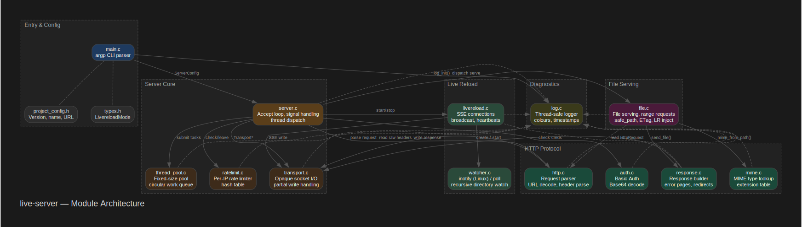
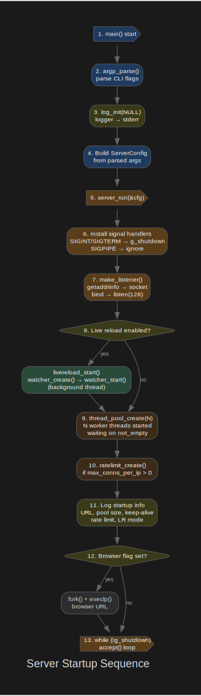
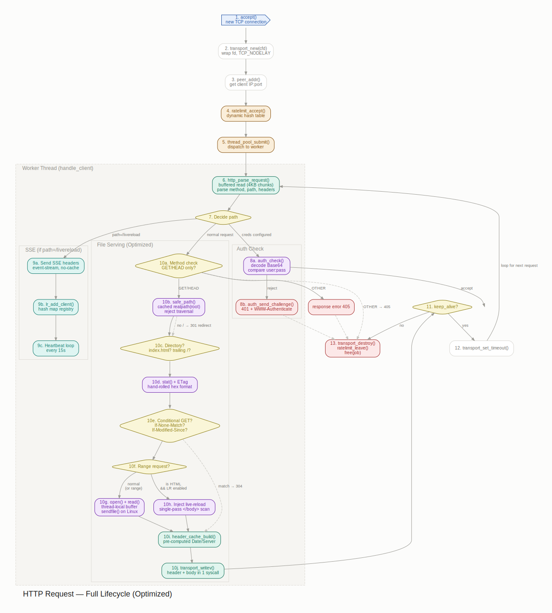
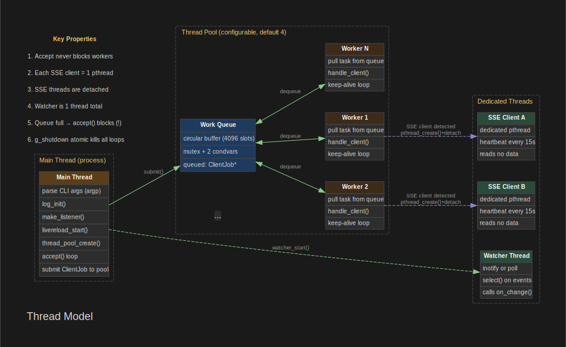

# live-server — Developer Guide

A lightweight, zero-dependency static file server with live reload, written in C17 for Linux and macOS.

---

## 1. High-Level Architecture


*Source: [assets/architecture.dot](assets/architecture.dot)*

No event loop library, no libuv, no async I/O. The server uses a **blocking-accept loop** with a **fixed-size thread pool**. Each accepted connection is dispatched as a task to the pool; the worker thread reads the HTTP request, serves the file, and optionally loops for keep-alive.

---

## 2. Startup Flow


*Source: [assets/startup-flow.dot](assets/startup-flow.dot)*

### 2.1 `src/main.c` — Entry Point

1. **argp CLI parsing** — `argp_parse()` calls `parse_opt()` for each flag. All options are written to the global `Arguments` struct `G_Args`.
2. **`log_init(NULL)`** — Initialises the logger to stderr with colour detection (TTY → colours, file → no colours).
3. **Build `ServerConfig`** — Maps `Arguments` fields into `ServerConfig cfg`.
4. **`server_run(&cfg)`** — Hands control to the server; this call blocks until SIGINT/SIGTERM.

Command-line parsing details:
- `-U` (soft reload) and `-W` (hard reload) are mutually exclusive — enforced at parse time.
- `-p` (password) with no value defaults both user and password to `"admin"`.
- `-u` (user) without `-p` is rejected at `ARGP_KEY_END`.
- `--dir` is validated against the filesystem at parse time (skipped for `"."`).
- Thread count is clamped to 1–256, port to 1–65535, keep-alive timeout to 0–3600, max-conns to 0–1000.

### 2.2 `src/server.c` — Server Core

`server_run()` does the following in order:

1. **Signal handlers** — SIGINT and SIGTERM set `g_shutdown` atomic flag. SIGPIPE is ignored (`SIG_IGN`) so that `write()` on a closed socket returns -1 instead of crashing.
2. **`make_listener()`** — Creates a TCP socket bound to `host:port`:
   - Uses `getaddrinfo()` for address resolution (IPv4/IPv6 agnostic).
   - Sets `SO_REUSEADDR` and `SO_REUSEPORT`.
   - Calls `listen(lfd, 128)`.
3. **`livereload_start()`** — If live reload is enabled, starts the file watcher in a background thread.
4. **`thread_pool_create()`** — Creates the thread pool with the configured number of workers.
5. **`ratelimit_create()`** — If `max_conns_per_ip > 0`, creates the rate limiter.
6. **Logging startup info** — Logs the serving URL, thread pool size, keep-alive, rate limit, and live-reload mode.
7. **`open_browser()`** — If `-B` was given, forks and execs the browser. Falls back to `open` (macOS) or `xdg-open` (Linux) on failure.
8. **Accept loop** — Blocks on `accept()`:
   - On incoming connection: wraps the fd in a `Transport`, creates a `ClientJob`, checks rate limit, and submits to the thread pool.
   - On shutdown: closes the listener, destroys thread pool, rate limiter, and livereload system.

### 2.3 The Accept Loop in Detail

```c
while (!g_shutdown) {
    cfd = accept(lfd, ...);                    // blocking
    Transport *t = transport_new(cfd);         // wrap socket
    transport_accept(t);                       // no-op (plain socket)
    peer_addr(cfd, ip, &port);                 // get client IP:port
    if (ratelimit_accept(rl, ip) != 0) {       // check rate limit
        http_send_status(429, ...);            // reject
        continue;
    }
    ClientJob *job = malloc(...);
    job->t = t; job->client_ip = ip; ...
    thread_pool_submit(pool, handle_client, job);  // dispatch
}
```

---

## 3. Module Deep Dive

### 3.1 `transport.c` — Socket I/O Abstraction

An **opaque** `Transport` struct wraps a raw file descriptor. The rest of the server never touches `read()`/`write()` directly.

```c
struct Transport {
    int fd;  // underlying socket
};
```

Key behaviours:
- `transport_write()` handles **partial writes** — loops until all bytes are sent or an error occurs. EINTR causes a retry.
- `transport_set_timeout()` sets `SO_RCVTIMEO` on the socket (used for keep-alive).
- `transport_destroy()` nullifies the caller's pointer after freeing.
- `transport_is_tls()` always returns false — TLS was removed.

Why opaque: in a future version, Transport could wrap TLS without changing any calling code.

### 3.2 `http.c` — HTTP Request Parser

Parses the complete HTTP request from the wire into an `HttpRequest` struct.

**Parsing flow:**

1. **`read_headers()`** — Reads one byte at a time from the transport until `\r\n\r\n` is found (end of headers). Stored in `HttpRequest.raw[8192]`.
2. **Request line** — Splits on spaces into method, URI, version:
   - Method: `GET` → `HTTP_GET`, `HEAD` → `HTTP_HEAD`, anything else → `HTTP_OTHER`.
   - URI is split on `?` into path and query string.
   - Path is URL-decoded via `http_url_decode()` (handles `%XX` and `+`).
   - **Path traversal check**: if the decoded path contains `..`, the request is rejected immediately.
3. **Headers** — Each subsequent `\r\n`-delimited line is parsed:
   - Header name is lowercased for matching.
   - Extracted: `Host`, `Authorization`, `Connection`, `If-None-Match`, `If-Modified-Since`, `Range`.
   - The `Range` parser handles `bytes=N-M`, `bytes=N-`, and `bytes=-N` (suffix).

**Notable**: The entire request (up to 8192 bytes) is buffered in RAM. No streaming body handling — only GET/HEAD are supported.

`HttpRequest` fields:
```c
HttpMethod method;        // GET / HEAD / OTHER
char path[4096];          // URL-decoded path, no query
char query[2048];         // query string
char version[16];         // e.g. "HTTP/1.1"
char host[256];           // Host header
char auth[512];           // Authorization header
char connection[32];      // Connection header
char if_none_match[128];  // ETag validation
char if_modified_since[64];
int64_t range_start;      // -1 = not specified
int64_t range_end;        // -1 = open-ended
char raw[8192];           // raw request data
size_t raw_len;
```

### 3.3 `response.c` — HTTP Response Builder

Three public functions + one internal helper.

- **`response_send()`** — Formats and sends a complete HTTP/1.1 response:
  - RFC 1123 `Date` header (current time in GMT).
  - `Server` header with binary name and version from `project_config.h`.
  - Optional `Content-Type` header.
  - `Content-Length` header.
  - Optional extra headers (ETag, Last-Modified, Location, etc.).
  - `Connection: keep-alive` or `Connection: close` based on the `keep_alive` parameter.
  - A `send_body` flag controls whether the body is written (for HEAD requests — per RFC 9110 §9.3.4).

- **`response_error()`** — Builds a styled HTML error page with light/dark mode support via `prefers-color-scheme`. Sends it via `response_send()`.

- **`response_redirect()`** — Sends a 301 with `Location` header.

Internal: `write_all()` loops to handle partial writes (defence in depth; `transport_write()` already handles partial writes).

### 3.4 `file.c` — Static File Serving

The most complex module. `file_serve()` is the entry point:

1. **Method check** — Only GET and HEAD are allowed; anything else returns 405.
2. **Path safety** — `safe_path()` resolves the requested path against the document root:
   - Resolves the root to its real path via `realpath()`.
   - Resolves `root + url_path` to its real path.
   - Checks that the resolved path is **under** the real root (prefix check).
   - If the path doesn't exist yet (e.g. new file), falls back to resolving the directory part and verifying the filename doesn't contain `..`.
   - This prevents path traversal attacks (e.g. `/../../../etc/passwd`).
3. **Stat and type check** — If the resolved path is a directory:
   - If no trailing `/`, redirects (301) to add it.
   - If trailing `/`, looks for `index.html` inside.
   - If not a directory but also not a regular file, returns 403.
4. **`send_file()`** — The core file-serving function:

   a. **ETag generation** — `"<mtime-hex>-<size-hex>"` (e.g. `"1a2b3c4d-5678"`).
   b. **Conditional GET** — If `If-None-Match` matches or `If-Modified-Since` shows no modification, returns 304.
   c. **Live-reload injection** — If the file is HTML and live reload is enabled:
      - Reads the entire file into a malloc'd buffer.
      - Inserts `<script>` with an `EventSource` before `</body>`.
      - Sets `Cache-Control: no-store` to prevent caching of the injected script.
   d. **Range request handling** — If `Range` was specified:
      - Computes the requested range, handles suffix ranges (`-500` = last 500 bytes).
      - Validates the range against the file size. Returns 416 `Range Not Satisfiable` if invalid.
      - Seeks to the start position with `lseek()`.
   e. **Read and send** — Reads the appropriate bytes from the file, builds `ETag`/`Last-Modified`/`Accept-Ranges` extra headers, and sends the response (200 or 206).

**Access logging**: Every request is logged to `LOG_INFO` with client IP, method, path, version, status, bytes, and MIME type. If `--print-request` is set, raw headers are dumped at `LOG_LEVEL_DEBUG`.

### 3.5 `auth.c` — HTTP Basic Authentication

1. **`auth_check()`** — Extracts the `Authorization: Basic <base64>` header, Base64-decodes it, splits on `:`, and compares against expected user/password.
2. **`auth_send_challenge()`** — Sends 401 with `WWW-Authenticate: Basic realm="live-server"`.

Base64 decoder is hand-rolled (no external dependency). Handles padding (`=`) correctly.

### 3.6 `thread_pool.c` — Fixed-Size Thread Pool

A circular buffer of 4096 tasks, protected by a mutex and two condition variables.

- `thread_pool_create(N)` — Creates N worker threads (clamped 1–256). Each worker runs `worker_loop()`.
- `thread_pool_submit()` — Adds a task to the queue. Blocks if the queue is full (waits on `not_full`).
- `thread_pool_destroy()` — Sets `stop` flag, broadcasts both condition variables to wake all workers, joins all threads.

Worker loop:
```c
while (1) {
    lock()
    while (count == 0 && !stop) wait(not_empty)
    if (stop && count == 0) { unlock(); break; }
    task = dequeue()
    unlock()
    task.func(task.arg)   // execute outside the lock
}
```

### 3.7 `livereload.c` — Server-Sent Events (SSE)

Manages SSE connections and broadcasts reload events.

- **`livereload_start()`** — Initialises the client registry (256 slots), allocates a copy of the reload mode, creates a `Watcher`, and starts it.
- **`livereload_handle_sse()`** — Called in a dedicated pthread for each `/livereload` connection:
  1. Sends SSE headers (`Content-Type: text/event-stream`, `Cache-Control: no-cache`, `Access-Control-Allow-Origin: *`).
  2. Registers the client in the registry (`lr_add_client`).
  3. Enters a heartbeat loop: sends `: heartbeat\n\n` every 15 seconds. If the write fails, the client is considered disconnected.
  4. On exit, removes the client from the registry.
- **`livereload_broadcast()`** — Sends `data: <event>\n\n` to all connected clients. Removes clients whose write fails.
- **File change callback** — When `watcher.c` detects a change, `on_change()` is called, which broadcasts `"reload"` or `"hard-reload"` depending on the mode.

### 3.8 `watcher.c` — File-System Watcher

Two backends, compiled conditionally:

**Linux inotify** (default):
- Creates an inotify fd, recursively adds watches for all directories under root.
- Thread blocks on `select()` with both the inotify fd and a wake pipe (for shutdown).
- On event: reads `inotify_event` structs, resolves the directory path, and calls the user callback.
- If a new directory is created (`IN_CREATE`|`IN_MOVED_TO` and `S_ISDIR`), it is recursively added to the watch set.
- Wake pipe: on shutdown, a byte is written to the pipe, which unblocks `select()`.

**Poll fallback** (macOS and `--poll` on Linux):
- Takes a snapshot of all files under root with their mtimes.
- Every 500ms, takes another snapshot and compares:
  - Different number of entries → change detected.
  - Any file's mtime changed → change detected.
- Uses `select()` on the wake pipe for interruptible sleep.
- Calls the callback with `path = NULL` (we know something changed but not what).

### 3.9 `ratelimit.c` — Per-IP Rate Limiting

Open-addressing hash table (1024 slots) with linear probing.

- `ratelimit_accept()` — Hashes the IP with djb2, finds the slot (empty or matching), increments the counter. Returns 0 if allowed, -1 if over limit.
- `ratelimit_leave()` — Decrements the counter for the given IP. Clears the entry when count reaches 0.
- Thread safety: a single mutex covers all table operations.

**Limitation**: The table uses linear probing without deletion tombstones. This works because entries are cleared to zero when count reaches 0, but could degrade under high churn.

### 3.10 `mime.c` — MIME Type Detection

A static lookup table mapping extensions to MIME types. Case-insensitive matching via `strcasecmp()`. Falls back to `application/octet-stream` for unknown extensions.

Covers: HTML, CSS, JS/TS, JSON, XML, images (PNG, JPEG, GIF, ICO, WebP, AVIF, BMP, TIFF, SVG), fonts (WOFF, WOFF2, TTF, OTF), audio (MP3, OGG, Opus, WAV, FLAC, AAC), video (MP4, WebM, OGV, MOV, AVI), text (TXT, MD, CSV), PDF, ZIP, GZ, TAR, WASM.

### 3.11 `log.c` — Thread-Safe Logger

- Four levels: ERROR, WARN, INFO, DEBUG.
- Uses a `pthread_rwlock` — readers (logging threads) share a read lock; `log_init()` and `log_set_level()` take a write lock.
- Timestamps: microsecond precision (`[HH:MM:SS.ffffff]`) when `LOG_SHOW_TIME_STAMP` is defined.
- Source location: `[file:line:function]` when `LOG_SHOW_SOURCE_LOCATION` is defined.
- Colour output: auto-detected by `isatty()`. Logging to a file disables colours.
- `LOG_PERROR()` — Logs an error and appends `strerror(errno)` via `perror()`.

### 3.12 `types.h` and `project_config.h`

- **`types.h`** — Defines `LivereloadMode` enum: `LIVERELOAD_OFF`, `LIVERELOAD_SOFT_RELOAD`, `LIVERELOAD_HARD_RELOAD`.
- **`project_config.h`** — Build-time constants: `PROJECT_VERSION "2.7.0"`, `MAIN_BINARY "live-server"`, `PROJECT_HOMEPAGE_URL`, `AUTH_MESSAGE`.

---

## 4. Request Lifecycle (Complete Example)


*Source: [assets/request-lifecycle.dot](assets/request-lifecycle.dot)*


*Source: [assets/thread-model.dot](assets/thread-model.dot)*

---

## 5. Build System

### 5.1 `Makefile` — Top Level

- Source files: `$(wildcard src/*.c)` → built into `build/src/*.o`.
- Headers: `$(wildcard src/*.h)` — no explicit dependency tracking (relies on `make` timestamps via the `.c`→`.o` rule).
- `CFLAGS`: `-Wall -Wextra -Wpedantic -Wstrict-prototypes -Wmissing-prototypes -Wshadow -Wconversion -std=c17 -Isrc`.
- Compile-time defines: `LOG_SHOW_TIME_STAMP`, `LOG_SHOW_SOURCE_LOCATION` are enabled unconditionally.
- **macOS**: links `-largp` from Homebrew. Does **not** define `_GNU_SOURCE`.
- **Linux**: defines `_GNU_SOURCE` (needed for `strptime()`, `timegm()`, `strcasestr()`).
- Debug build: adds `-g3 -DDEBUG -fstack-usage -fsanitize=address -fsanitize=undefined`. On clang, adds `-ffreestanding`.

### 5.2 `tests/Makefile` — Unit Tests

- Compiles `tests/test_*.cpp` with **C++17** (`-std=c++17`), linking against all `build/src/*.o` **except** `main.o`.
- Uses the [doctest](https://github.com/doctest/doctest) single-header testing framework (`tests/doctest.h`).
- Test binaries are placed at `build/TEST-<name>`.

**Build order matters**: `make test` first runs `$(BIN)` (release build) to ensure all `src/*.o` exist, then delegates to `tests/Makefile`.

---

## 6. Testing

### Unit Tests (`make test`)

- Written in C++ with doctest, testing C modules via `extern "C"`.
- Currently one test file: `tests/test_mime.cpp` — tests `mime_from_path()` with 50+ cases (known extensions, images, fonts, audio, video, text, archives, case insensitivity, fallback, edge cases including NULL, empty string, no extension).

### Integration Tests (`tests/test_server.sh`)

- Starts the server on port 9999 (configurable), runs 26 tests via `curl`.
- Tests: 200, 301, 304, 404, 405, 416, 429 status codes; ETag conditional requests; byte ranges; keep-alive headers; Basic Auth (both missing and correct); path traversal rejection; `--help` and `--version`.
- Server is started with `-L error -t 2 -k 5` for silent, predictable behaviour.
- PID is tracked in `/tmp/live_server_test.pid`; cleanup kills all PIDs on exit.

---

## 7. Key Design Decisions

| Decision | Rationale |
|---|---|
| **Blocking I/O + thread pool** | Simpler than async I/O. POSIX threads are always available. Pool prevents connection flood. |
| **One byte at a time header reading** | Avoids dealing with partial reads at the parser level. Fine for HTTP headers (typically < 8KB). |
| **Entire file in memory for serving** | Simplicity. Files are read completely, optionally modified (live-reload injection), then sent. Not suitable for streaming large files. |
| **No directory listing** | Intentionally omitted. If a directory has no `index.html`, returns 404. |
| **No compression** | Simplifies the code significantly. Live-reload injection would need to decompress first anyway. |
| **No TLS** | Was present in an earlier version, removed to keep zero-dependency promise. Pair with a reverse proxy for HTTPS. |
| **Poll on macOS** | macOS has no inotify. `kqueue` could be added but poll is portable and simple. |
| **Opaque Transport** | Abstraction for future TLS support without changing calling code. |
| **Mutex in ratelimit** | Simple, correct. The table is small (1024 slots × 64-byte IP = 64KB) and lookups are fast. |

---

## 8. File Map

```
src/
├── main.c              # Entry point, argp CLI parsing
├── server.c / .h       # Accept loop, thread pool dispatch, keep-alive
├── transport.c / .h    # Opaque socket I/O wrapper
├── http.c / .h         # HTTP request parser
├── response.c / .h     # HTTP response builder (status, error, redirect)
├── file.c / .h         # Static file serving, range, live-reload inject
├── auth.c / .h         # Basic Authentication
├── thread_pool.c / .h  # Fixed-size thread pool
├── livereload.c / .h   # SSE connection management
├── watcher.c / .h      # File watcher (inotify / poll)
├── ratelimit.c / .h    # Per-IP connection rate limiting
├── mime.c / .h         # MIME type lookup by extension
├── log.c / .h          # Thread-safe coloured logger
├── types.h             # LivereloadMode enum
└── project_config.h    # Version, name, URL constants

tests/
├── test_server.sh      # 26 integration tests via bash + curl
├── test_data/          # Fixture files (index.html, style.css, etc.)
└── test_mime.cpp       # Unit tests for MIME module

build/                  # Build artifacts (gitignored)
├── src/*.o             # Compiled object files
└── TEST-*              # Unit test binaries
```
